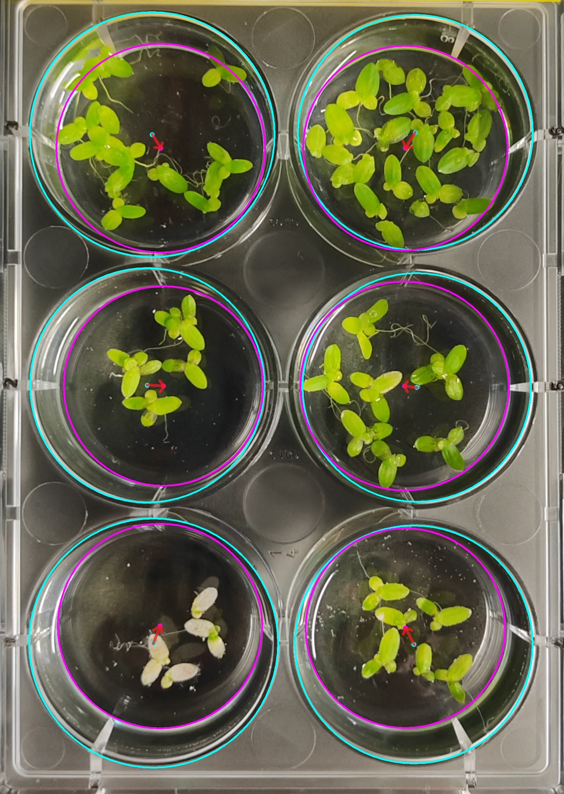
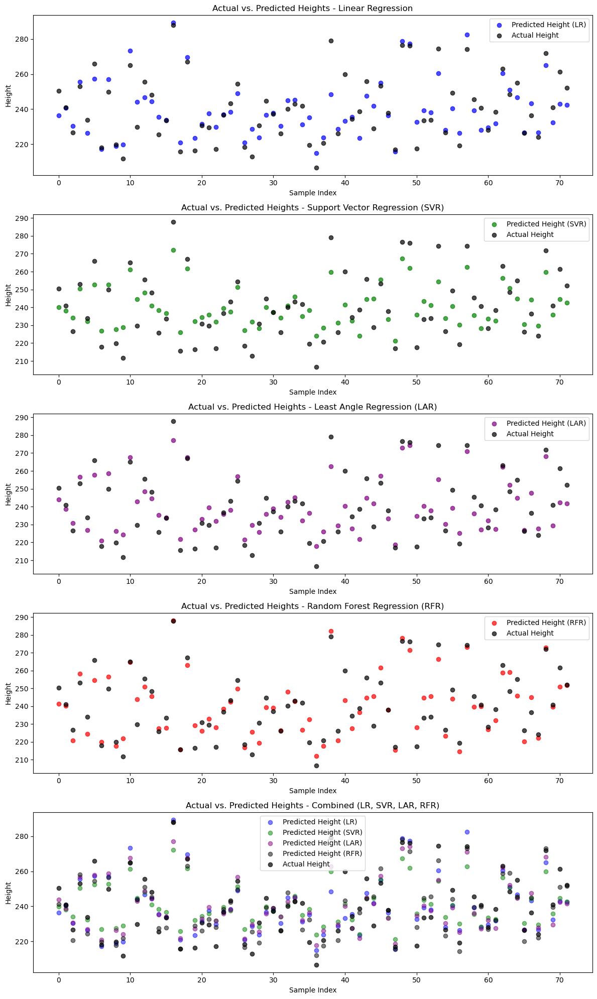
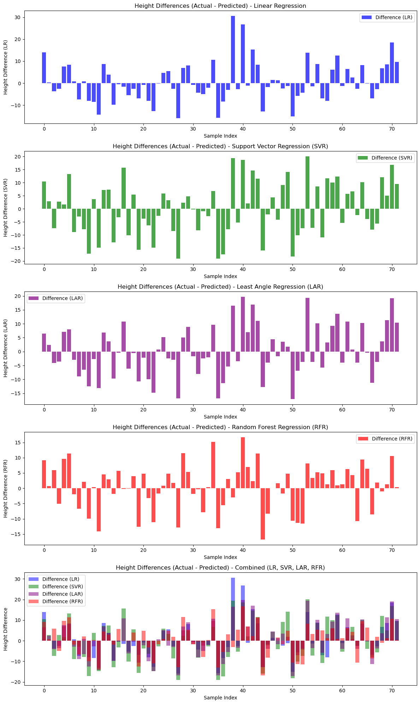
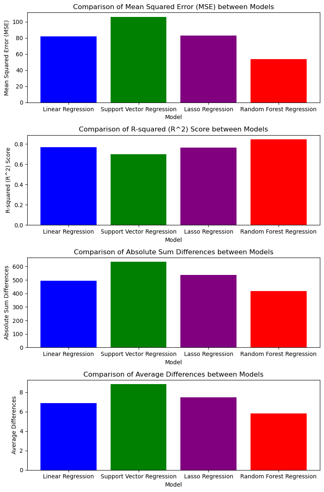

# Camera Height Estimation with the Info from Detected Tubes in Image

This repository has been established to pursue the development of a model aimed at estimating camera height. It is a subsequent project of [QR_and_Symbol_Detection-Image_Analysis](https://github.com/Alperenlcr/QR_and_Symbol_Detection-Image_Analysis). The primary objective is to explore the relationship between six vectors which are originating from the top circle center of a tube, extending to the bottom circle center of the tube within an image, and the corresponding camera-determined height. The project relies on the utilization of the "all_data.csv" file available in the repository. The training of models focuses on using vector attributes such as the starting point, length, and angle. Multiple regression approaches have been experimented with, and the top four performing models have been highlighted for reference.

### The red arrows in the image represent the vectors:

## Dataset

**Column names and an example row from `all_data.csv`**

| Attribute               | Value                   |
|-------------------------|-------------------------|
| Date                    |: 2023-07-25 10:00:59     |
| QR Code                 |: 705548                  |
| Experiment Number       |: 1                       |
| Light                   |: 101                     |
| Phone Name              |: Huawei P60 Pro          |
| Image Name              |: IMG_20230725_100059.jpg |
| Black Rectangle Corners |: {'lt': [610, 720], 'rt': [2380, 725], 'lb': [540, 3605], 'rb': [2500, 3585]} |
| Height (Bottom)         |: 230.230361              |
| Height (Top)            |: 254.95661               |
| Height                  |: 242.593485              |
| Circles Info            |: {'big_circle_centers': [[424, 392, 354], [410, 1078, 324], [422, 1786, 335], [1158, 366, 329], [1164, 1084, 316], [1150, 1788, 332]], 'small_circle_centers': [[440, 448, 291], [448, 1098, 291], [438, 1774, 285], [1150, 432, 267], [1136, 1108, 279], [1122, 1778, 287]]} |
| Angle Multiplier Info   |: Normal, x angle multiplier:-7.2, y angle multiplier:0.6 |
| Saving ID               |: 73                      |

**After applying filtering operations, the independent variables table transforms into the following:**

| Attribute          | Value     || Attribute          | Value     |
|--------------------|-----------|-|--------------------|-----------|
| x1                 |: 424       |\|| x4                 |: 1158      |
| y1                 |: 392       |\|| y4                 |: 366       |
| length1            |: 58.241    |\|| length4            |: 66.483    |
| angle_degrees1     |: 74.055    |\|| angle_degrees4     |: 96.911    |
| x2                 |: 410       |\|| x5                 |: 1164      |
| y2                 |: 1078      |\|| y5                 |: 1084      |
| length2            |: 42.942    |\|| length5            |: 36.878    |
| angle_degrees2     |: 27.759    |\|| angle_degrees5     |: 139.399   |
| x3                 |: 422       |\|| x6                 |: 1150      |
| y3                 |: 1786      |\|| y6                 |: 1788      |
| length3            |: 20        |\|| length6            |: 29.732    |
| angle_degrees3     |: 323.13    |\|| angle_degrees6     |: 199.654   |
|                    |           ||                    |           |

**Subsequently, a min-max scaling operation was applied to all independent variables, while the dependent variable, the height of the phone in millimeters (mm), remained unchanged.**

## Approach and Results
Different models were tested and a few were selected. The dataset was then optimized to improve results. Below are the obtained results:
#

#

#

#
## Here are the steps to run the code in Jupyter Anaconda:

1. Clone the Repository
    ```
    $ git clone <RepositoryURL>
    ```
2. Change to the Repository Directory
    ```
    $ cd Camera_Height_Estimation/
    ```
3. Create a Virtual Environment
    ```
    $ conda create --name camera_height python=3.10
    ```
4. Activate the Conda Environment
    ```
    $ conda activate camera_height
    ```
5. Install Dependencies using Conda
    ```
    $ conda install --file requirements.txt
    ```
6. Launch Jupyter Notebook
    ```
    $ jupyter notebook
    ```
7. In Jupyter Notebook, navigate to the appropriate directory and Jupyter Notebook file named `main.ipynb`.